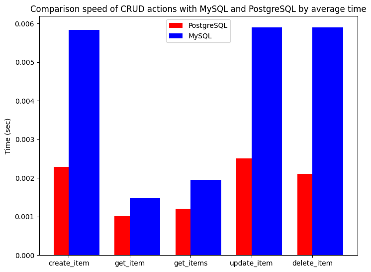
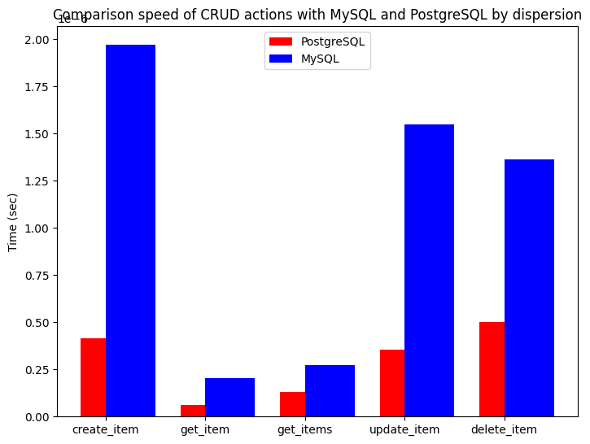

## Сравнение скорости CRUD операций (MySQL c PostgreSQL).

## Описание

Проект был разработан для сравнения скорости выполнения следующих операций в СУБД MySQL и PostgreSQL:

    - Создание элемента
    - Получение элемента
    - Получение всех элементов
    - Обновление элемента
    - Удаление элемента

## Зависимости:
    - Python - основной язык программирования
    - FastAPI - сервер
    - SQLAlchemy - orm для работы с СУБД
    - FactoryBoy - генерация данных
    - Requests - отправление запросов на сервер
    - Matplotlib - генерация графика

## Окружение
1. Развёртывание производится на операционной системе Manjaro
1. Требуется предустановленный интерпретатор Python версии 3.10.5, docker, docker-compose

## Использование

Запустим сервера с СУБД:

```bash
bash run
```

После этого запустятся контейнеры с MySQL, FastAPI подключенным к MySQL, PostgreSQL, FastAPI подключенным к PostgreSQL. После запуска всех 4 контейнеров запускается контейнер со скриптом для тестирования операций.
После запуска скрипта мы получим выходные данные в терминале и файлы `results_average_time.png` и `results_dispersion.png`. Пример выходных данных в терминале:

Database: mysql
 - create_item:
    - Average time: 0.00583520 sec.
    - Dispersion: 0.00000197 sec.
    - Template query: INSERT INTO users (name, surname, phone, email, passport_id, passport_series, created_at) VALUES (%(name)s, %(surname)s, %(phone)s, %(email)s, %(passport_id)s, %(passport_series)s, now())
    - Example query: INSERT INTO users (name, surname, phone, email, passport_id, passport_series, created_at) VALUES ('John', 'Davis', '8286010770', 'newtonjohn@example.net', '9051', '715156', now())
  - get_item:
    - Average time: 0.00148958 sec.
    - Dispersion: 0.00000020 sec.
    - Template query: SELECT users.id, users.name, users.surname, users.phone, users.email, users.passport_id, users.passport_series, users.created_at FROM users WHERE users.id = %(id_1)s
    - Example query: SELECT users.id, users.name, users.surname, users.phone, users.email, users.passport_id, users.passport_series, users.created_at FROM users WHERE users.id = 45
  - get_items:
    - Average time: 0.00195236 sec.
    - Dispersion: 0.00000027 sec.
    - Template query: SELECT users.id, users.name, users.surname, users.phone, users.email, users.passport_id, users.passport_series, users.created_at FROM users
    - Example query: SELECT users.id, users.name, users.surname, users.phone, users.email, users.passport_id, users.passport_series, users.created_at FROM users
  - update_item:
    - Average time: 0.00589619 sec.
    - Dispersion: 0.00000155 sec.
    - Template query: UPDATE users SET name=%(name)s, surname=%(surname)s, phone=%(phone)s, email=%(email)s, passport_id=%(passport_id)s, passport_series=%(passport_series)s WHERE users.id = %(id_1)s
    - Example query: UPDATE users SET name='Angela_new', surname='Martin_new', phone='3351994889', email='alexandramoss@example.com', passport_id='373', passport_series='304444' WHERE users.id = 17
  - delete_item:
    - Average time: 0.00589903 sec.
    - Dispersion: 0.00000136 sec.
    - Template query: DELETE FROM users WHERE users.id = %(id_1)s
    - Example query: DELETE FROM users WHERE users.id = 18

Database: postgresql
  - create_item:
    - Average time: 0.00228066 sec.
    - Dispersion: 0.00000042 sec.
    - Template query: INSERT INTO users (name, surname, phone, email, passport_id, passport_series, created_at) VALUES (%(name)s, %(surname)s, %(phone)s, %(email)s, %(passport_id)s, %(passport_series)s, now()) RETURNING users.id
    - Example query: INSERT INTO users (name, surname, phone, email, passport_id, passport_series, created_at) VALUES ('Bradley_new', 'Boyd_new', '2775819635', 'plloyd@example.org', '8873', '372051', now()) RETURNING users.id
  - get_item:
    - Average time: 0.00101063 sec.
    - Dispersion: 0.00000006 sec.
    - Template query: SELECT users.id, users.name, users.surname, users.phone, users.email, users.passport_id, users.passport_series, users.created_at FROM users WHERE users.id = %(id_1)s
    - Example query: SELECT users.id, users.name, users.surname, users.phone, users.email, users.passport_id, users.passport_series, users.created_at FROM users 
    WHERE users.id = 17
  - get_items:
    - Average time: 0.00119833 sec.
    - Dispersion: 0.00000013 sec.
    - Template query: SELECT users.id, users.name, users.surname, users.phone, users.email, users.passport_id, users.passport_series, users.created_at FROM users
    - Example query: SELECT users.id, users.name, users.surname, users.phone, users.email, users.passport_id, users.passport_series, users.created_at FROM users
  - update_item:
    - Average time: 0.00250604 sec.
    - Dispersion: 0.00000035 sec.
    - Template query: UPDATE users SET name=%(name)s, surname=%(surname)s, phone=%(phone)s, email=%(email)s, passport_id=%(passport_id)s, passport_series=%(passport_series)s WHERE users.id = %(id_1)s
    - Example query: UPDATE users SET name='Philip_new_new', surname='Swanson_new_new', phone='8273330294', email='kyle76@example.org', passport_id='2398', passport_series='677361' WHERE users.id = 69
  - delete_item:
    - Average time: 0.00210219 sec.
    - Dispersion: 0.00000050 sec.
    - Template query: DELETE FROM users WHERE users.id = %(id_1)s
    - Example query: DELETE FROM users WHERE users.id = 35



