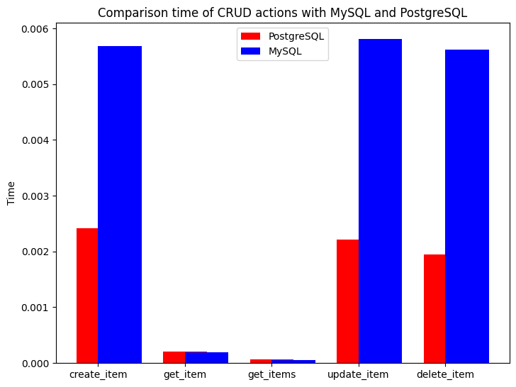

## Сравнение скорости CRUD операций (MySQL c PostgreSQL).

Матвиенко Назар Артемович КИ20-16/1Б


## Описание

Проект был разработан для сравнения скорости выполнения следующих операций в СУБД MySQL и PostgreSQL:

    - Создание элемента
    - Получение элемента
    - Получение всех элементов
    - Обновление элемента
    - Удаление элемента

## Зависимости:
    - Python - основной язык программирования
    - FastAPI - сервер
    - SQLAlchemy - orm для работы с СУБД
    - FactoryBoy - генерация данных
    - Requests - отправление запросов на сервер
    - Matplotlib - генерация графика

## Окружение
1. Развёртывание производится на операционной системе Manjaro
1. Требуется предустановленный интерпретатор Python версии 3.10.5, docker, docker-compose

## Использование

Запустим сервера с СУБД:

```bash
bash run_containers
```

После этого запустятся контейнеры с MySQL, FastAPI подключенным к MySQL, PostgreSQL, FastAPI подключенным к PostgreSQL. После запуска всех 4 контейнеров запустим скрипт для тестирования операций:

```bash
bash run_script
```
После запуска скрипта мы получим выходные данные в терминале и файла `results.png`. Пример выходных данных в терминале:

Database: postgresql
- create_item:
  - Average time: 0.0024188995361328126
  - Template query: INSERT INTO users (name, surname, phone, email, passport_id, passport_series, created_at) VALUES (%(name)s, %(surname)s, %(phone)s, %(email)s, %(passport_id)s, %(passport_series)s, now()) RETURNING users.id
  - Example query: INSERT INTO users (name, surname, phone, email, passport_id, passport_series, created_at) VALUES ('Isaiah_new', 'Kennedy_new', '841273788', 'santanasydney@example.net', '6315', '61691', now()) RETURNING users.id
- get_item:
  - Average time: 0.00019975662231445313
  - emplate query: SELECT users.id, users.name, users.surname, users.phone, users.email, users.passport_id, users.passport_series, users.created_at FROM users WHERE users.id = %(id_1)s
  - Example query: SELECT users.id, users.name, users.surname, users.phone, users.email, users.passport_id, users.passport_series, users.created_at FROM users WHERE users.id = 12
- get_items:
  - Average time: 7.07864761352539e-05
  - Template query: SELECT users.id, users.name, users.surname, users.phone, users.email, users.passport_id, users.passport_series, users.created_at FROM users
  - Example query: SELECT users.id, users.name, users.surname, users.phone, users.email, users.passport_id, users.passport_series, users.created_at FROM users
- update_item:
  - Average time: 0.0022148942947387697
  - Template query: UPDATE users SET name=%(name)s, surname=%(surname)s, phone=%(phone)s, email=%(email)s, passport_id=%(passport_id)s, passport_series=%(passport_series)s WHERE users.id = %(id_1)s
  - Example query: UPDATE users SET name='Haley_new_new', surname='Henderson_new_new', phone='7882249105', email='jeffreyfrank@example.com', passport_id='850', passport_series='508324' WHERE users.id = 76
- delete_item:
  - Average time: 0.001939849853515625
  - Template query: DELETE FROM users WHERE users.id = %(id_1)s
  - Example query: DELETE FROM users WHERE users.id = 26


